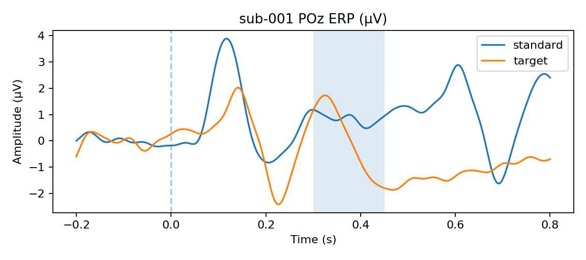
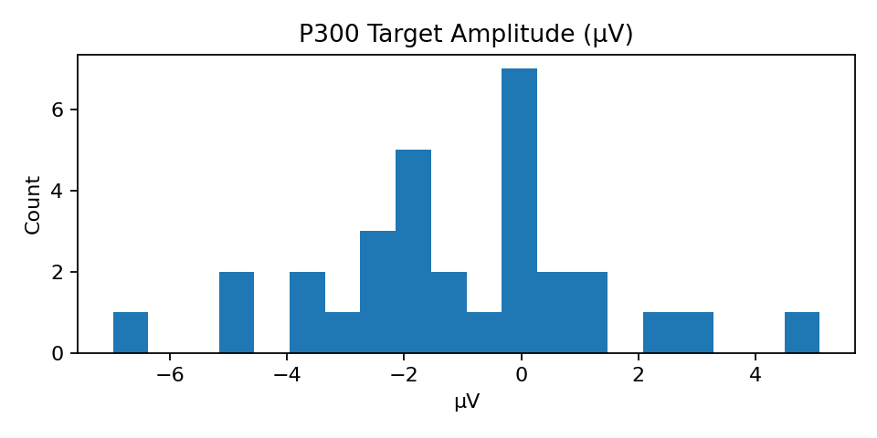



# P300 ERP — Analysis Snapshot (31 subjects)

### Results at a glance
- Processed **31** subjects; artifacts and KPIs available.
- Full summary: [outputs_bids/summary/summary.md](outputs_bids/summary/summary.md)

**Example ERP (subject 001, POz):**

**Cohort amplitude histogram (targets):**

